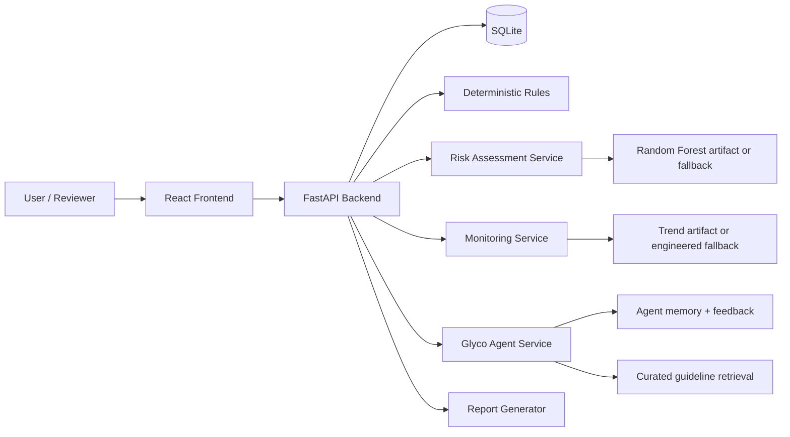

# Glyco

Glyco is a full-stack clinical support MVP for Type 2 diabetes risk, monitoring, reporting, and assisted conversation. It is designed for a FIT CC Coding Challenge demo, but it is also structured so human reviewers and AI agents can understand the application end-to-end without guessing how any major piece works.

Glyco combines:

- a React + Vite frontend
- a FastAPI backend
- SQLite persistence
- deterministic clinical rules
- trained machine-learning artifacts for risk and monitoring inference
- agent memory and feedback-based personalization
- report generation, family sharing, and proactive alerting

It supports screening, trend interpretation, and patient education. It does not diagnose disease and it must not be presented as a substitute for clinical judgment.

## What Glyco Is For

Glyco helps a user or reviewer do seven things well:

- enter a patient profile and compute a diabetes risk assessment
- log glucose readings and build a monitoring trend
- ask a natural-language question to the agent
- get guided next steps and doctor-facing questions
- generate structured reports for doctor, family, or weekly review
- share a simplified family view
- observe how feedback changes the next response

The product is intentionally not chatbot-only. The intelligence is exposed through models, rules, summaries, reports, alerts, and explainable UI surfaces.

## High-Level Architecture



The backend is the control plane. The frontend is a thin experience layer over persisted assessments, reports, alerts, and agent responses.

## Frontend Experience

The frontend lives in `frontend/` and is a React 19 + Vite app. The main routes are:

- `/overview` for the main dashboard
- `/agent` for the natural-language Glyco agent
- `/risk-check` for the profile-driven risk flow
- `/monitoring` for glucose logging and trend tracking
- `/metric/:metricId` for detail pages
- `/reports` for saved reports
- `/care-plan` for nutrition and lifestyle guidance
- `/family` and `/share/:token` for shared care views

The visible UI stack includes:

- React Router
- TanStack Query
- Recharts
- React Hook Form
- Zod
- lucide-react icons

The frontend is not just decorative. It surfaces the outputs of the backend services directly:

- latest risk assessment
- latest monitoring assessment
- agent tool evidence
- learning summary from feedback
- alert state
- report list and PDF export
- family share information

## Backend Responsibilities

The backend lives in `backend/` and is built around FastAPI, SQLAlchemy, Pydantic, SQLite, and a service-oriented internal structure.

The key startup behavior is:

- environment variables are loaded from `.env` or `backend/.env`
- the database schema is created on startup
- a small SQLite migration shim adds `is_fasting` if needed
- demo data is seeded automatically
- the API is mounted under both `/api` and `/v1`

The backend exposes:

- profile management
- risk assessment generation
- glucose log ingestion
- monitoring assessment generation
- report generation and PDF export
- agent chat and feedback
- proactive safety checks
- Bayesian risk overlay
- family sharing endpoints

## AI / ML Design

Glyco has two distinct learning layers.

### 1. Offline ML Models

These are the trained artifacts stored in `ml/artifacts/`.

Risk model:

- uses a random forest classifier
- is trained from the CDC BRFSS diabetes dataset
- expects a fixed profile feature contract
- produces a probability, a risk level, and metadata
- current model version is `random-forest-0.2`

Monitoring model:

- uses a random forest classifier
- is trained from the UCI diabetes time-series dataset
- consumes glucose-derived daily features
- labels the recent trend state
- current model version is `glucose-trend-random-forest-0.2`

The backend loads both model bundles with `joblib`. If artifacts are missing or cannot be loaded, the app falls back to deterministic logic rather than failing.

### 2. Online Personalization

This layer lives in the agent memory and feedback tables:

- `agent_feedback` stores whether a response was helpful, the preferred tone, confirmed actions, and notes
- `agent_memory` stores conversation turns
- `bayesian_risk_state` stores a per-user posterior risk overlay
- `bandit_arm_state` stores Thompson Sampling state for adaptive recommendation ranking

This means Glyco learns from usage in two ways:

- offline model training from datasets
- online personalization from actual user feedback

## Risk Inference

The risk flow starts with a clinical profile.

User-entered profile data includes age, sex, BMI-related inputs, blood pressure history, cholesterol history, smoking, physical activity, diet flags, general health, stroke history, heart disease history, walking difficulty, family history of diabetes, and optional fasting glucose / HbA1c.

The backend transforms that profile into the risk feature row expected by the model, including the BRFSS-style fields such as:

- `HighBP`
- `HighChol`
- `BMI`
- `Smoker`
- `Stroke`
- `HeartDiseaseorAttack`
- `PhysActivity`
- `Fruits`
- `Veggies`
- `GenHlth`
- `PhysHlth`
- `DiffWalk`
- `Sex`
- `Age`

The service then:

- predicts a probability
- maps the score to a risk level
- stores a `risk_assessments` row
- returns ranked contributing factors, related flags, explanation text, and model version

If the model artifacts are unavailable, the deterministic rules engine handles the assessment so the app remains usable.

## Monitoring Inference

Monitoring starts from glucose logs.

Each log stores:

- fasting or not fasting state
- fasting glucose
- optional post-meal glucose
- optional HbA1c, weight, BMI, blood pressure, activity, and notes

When enough logs exist, the backend builds daily features and passes them to the trend model. The feature contract includes values such as:

- glucose mean
- glucose standard deviation
- minimum and maximum glucose
- glucose count
- high-count and low-count flags
- meal event count
- exercise event count
- hypo event count
- glucose slope
- 3-day rolling mean, std, and count features

The monitoring service then:

- predicts the current trend label
- calculates the trend score
- stores a `monitoring_assessments` row
- returns summary JSON and anomaly flags

If there are too few logs or the artifacts fail to load, the backend falls back to explainable rules instead of crashing.

## Agent Design

Glyco’s agent is not a generic chatbot wrapper. It is a tool-grounded clinical support layer.

The main Gemini agent workflow:

1. load the patient profile
2. load recent glucose logs
3. run risk assessment
4. load Bayesian posterior state
5. run monitoring assessment
6. retrieve guideline snippets
7. load personalized learning summary
8. rerank recommendations with Thompson Sampling
9. generate a safe answer after receiving tool results

The agent tool layer can access:

- patient profile
- recent logs
- trained risk model output
- Bayesian overlay
- trained monitoring model output
- curated guideline snippets
- feedback memory
- recommendation bandit output

The agent also has proactive safety behavior. If the last three fasting glucose readings are all above the configured threshold, Glyco can generate a doctor report and create an alert instead of only replying conversationally.

The active LLM agent path is Gemini function calling: Gemini receives tool declarations, chooses tool calls, receives tool results, and then writes the final answer. If Gemini is not configured or the loop fails, Glyco falls back to the deterministic local pipeline that runs the same tools in a fixed order. Ollama remains a verbalization fallback, not a tool-calling agent.

## Agent Learning Loop

The feedback loop is one of the most important parts of the project.

After a response, the user can submit feedback with:

- whether the answer was helpful
- preferred tone
- confirmed action
- optional notes

That feedback influences the next response through:

- `learning_summary`
- preferred tone aggregation
- confirmed action memory
- preferred action type scoring
- recommendation reranking

This gives Glyco a visible online adaptation loop rather than a static prompt experience.

## Data Flow

The main data flow is:

1. the frontend collects profile data, readings, or chat messages
2. the backend validates and persists the data in SQLite
3. the relevant service converts stored data into features
4. the trained model or fallback rules produce a score and explanation
5. the result is stored as an assessment, alert, report, or memory row
6. the frontend reads the persisted result and renders it

The training datasets do not overwrite user-entered data. They only shape how the user data is interpreted.

## Persistence Model

The database is SQLite by default.

Important tables:

- `users`
- `profiles`
- `health_logs`
- `risk_assessments`
- `monitoring_assessments`
- `reports`
- `family_shares`
- `agent_alerts`
- `agent_feedback`
- `bayesian_risk_state`
- `bandit_arm_state`
- `agent_memory`

Default SQLite behavior:

- if `DATABASE_URL` is not set, the backend uses a local `glyco.db` next to the backend source tree
- because the path is resolved relative to the backend, starting the app from different working directories can create multiple database files if you are not careful

## Demo Data

The app seeds demo content on startup.

Demo users include:

- Sarah Kovac (`demo-monitoring`)
- Milan Hadzic (`demo-high-risk`)
- Lejla Moric (`demo-low-risk`)

The seeded family share token is:

- `demo-family-sarah`

This makes the project easy to demonstrate immediately after startup.

## API Summary

The base API paths are `/api` and `/v1`.

Core endpoints:

- `POST /users/demo`
- `GET /users/{user_id}`
- `POST /profiles`
- `GET /profiles/{user_id}`
- `PUT /profiles/{profile_id}`
- `POST /risk-assessment`
- `GET /risk-assessment/{user_id}/latest`
- `GET /risk/bayesian/{user_id}`
- `POST /logs`
- `GET /logs/{user_id}`
- `POST /monitoring-assessment?user_id=1`
- `GET /monitoring-assessment/{user_id}/latest`
- `POST /reports/{doctor|family|weekly}?user_id=1`
- `GET /reports/{user_id}`
- `GET /reports/{report_id}/pdf`
- `GET /insights/{user_id}`
- `POST /agent/chat`
- `POST /agent/feedback`
- `POST /agent/proactive-check/{user_id}`
- `GET /alerts/{user_id}`
- `POST /care-plan/diet?user_id=1`
- `POST /family-shares`
- `GET /family-shares/{share_token}`

There are also basic service endpoints:

- `GET /`
- `GET /health`

## Frontend Pages

The React app is organized by user task rather than technical subsystem:

- `Overview` combines the main state of the app
- `Agent` exposes the conversation workflow and tool evidence
- `RiskCheck` handles profile-based screening
- `Monitoring` handles logging and trend review
- `Reports` lists generated reports and PDF exports
- `CarePlan` presents lifestyle guidance
- `FamilyView` shows shared status for relatives or caregivers
- `MetricDetail` provides metric-specific context

## Core Files Worth Knowing

If you need to understand the system quickly, start here:

- `backend/app/main.py` for startup, schema creation, seeding, CORS, and router mounting
- `backend/app/api/routes.py` for the public API behavior
- `backend/app/db/models.py` for the persistence model
- `backend/app/ml/inference.py` for artifact loading and feature engineering
- `backend/app/agent/agent_service.py` for the main agent orchestration
- `backend/app/agent/proactive.py` for sustained glucose anomaly report generation
- `backend/app/services/assessments.py` for risk and monitoring assessment creation
- `backend/app/reports/generator.py` for report content generation
- `frontend/src/App.tsx` for the route map
- `frontend/src/api/client.ts` for the frontend-to-backend contract

## Local Setup

### Backend

```powershell
cd backend
python -m venv .venv
.\.venv\Scripts\pip install -r requirements.txt
.\.venv\Scripts\python -m uvicorn app.main:app --reload
```

Backend URL:

- `http://127.0.0.1:8000`
- API docs: `http://127.0.0.1:8000/docs`

### Frontend

```powershell
cd frontend
npm install
npm run dev
```

Frontend URL:

- `http://127.0.0.1:5173`

If port `5173` is taken, Vite may choose another nearby port.

### Docker

The repository also includes `docker-compose.yml` plus Dockerfiles for backend and frontend.

Typical compose usage:

```powershell
docker compose up --build
```

The compose file maps the backend to port `8000` and the frontend to port `80`.

## Environment Variables

Optional environment variables:

- `DATABASE_URL` to point the backend at a custom database
- `GLYCO_LLM_PROVIDER` to choose `deepseek`, `gemini`, or `ollama`
- `DEEPSEEK_API_KEY` / `GLYCO_DEEPSEEK_API_KEY` to enable the DeepSeek/OpenRouter chat-completions client
- `OPENROUTER_API_KEY` / `GLYCO_OPENROUTER_API_KEY` as an alias key name when using OpenRouter
- `GLYCO_DEEPSEEK_MODEL` to pick the model (default: `deepseek/deepseek-v4-flash:free`)
- `GLYCO_DEEPSEEK_URL` to choose the OpenAI-compatible base URL (default: `https://openrouter.ai/api/v1`)
- `GEMINI_API_KEY` or `GLYCO_GEMINI_API_KEY` to enable the Gemini function-calling agent
- `GLYCO_OLLAMA_URL` and `GLYCO_OLLAMA_MODEL` to enable local Ollama verbalization

If no database URL is provided, Glyco uses a local SQLite file path. If no LLM provider is configured, the agent uses fallback behavior.

Notes:

- For local runs, the backend loads a `.env` file from the repo root or `backend/.env`.
- If you use OpenRouter, some models marked as `:free` can still return `402 Payment Required` unless your OpenRouter account has credits/billing enabled.

## Training The Models

You do not need to retrain the models to run the app, but the pipeline is included and reproducible.

```powershell
python ml\scripts\prepare_datasets.py
python ml\scripts\train_risk_model.py
python ml\scripts\prepare_monitoring_data.py
python ml\scripts\train_monitoring_model.py
```

Generated outputs are written to:

- `data/processed`
- `ml/artifacts`

## Datasets

Risk model dataset:

- CDC BRFSS diabetes indicators dataset
- referenced as `diabetes_binary_health_indicators_BRFSS2015.csv.zip`

Monitoring model dataset:

- UCI diabetes time-series archive
- referenced as `diabetes.zip`

The processed summaries in `data/processed/` document the derived dataset structure used by the training scripts.

## Testing

Backend tests are located in `backend/tests/` and cover:

- agent chat fallback behavior
- agent tool dispatch
- proactive alert generation
- monitoring and risk flows
- report generation
- Bayesian and bandit state
- API-level expectations

Run backend tests with:

```powershell
cd backend
python -m pytest
```

Frontend build verification:

```powershell
cd frontend
npm run build
```

## Repository Structure

- `backend/` FastAPI app, database models, services, agent logic, rules, reports, and tests
- `frontend/` React UI, routes, pages, components, and client API wrapper
- `ml/` training scripts, feature preparation, and saved artifacts
- `data/` processed outputs and raw dataset material
- `docs/` architecture notes, API reference, datasets notes, and competition documentation
- `scripts/` utility scripts for documentation generation and project support

## Safety And Scope

Glyco is a support and education system. It is not a diagnostic system and it does not replace a clinician.

Important safety boundaries:

- outputs are interpretive and educational
- urgent patterns can trigger proactive alerts and doctor-report generation
- deterministic rules remain active when models are unavailable
- the agent always grounds responses in profile, logs, rules, or guidelines rather than free-form hallucination alone

## If You Are An AI Agent Reading This

Use the following order of truth:

1. `backend/app/main.py` for startup and app wiring
2. `backend/app/api/routes.py` for endpoint behavior
3. `backend/app/agent/agent_service.py` for conversational behavior
4. `backend/app/ml/inference.py` for ML feature contracts and fallback logic
5. `backend/app/db/models.py` for the persistence schema
6. `frontend/src/api/client.ts` and `frontend/src/App.tsx` for frontend contracts and routes

Do not assume a feature exists unless it is reflected in the code, the database model, or the API layer.

## Short Summary

Glyco is a diabetes support platform that:

- stores patient profile and glucose monitoring data
- scores risk with a model trained on CDC BRFSS data
- scores monitoring trends with a model trained on UCI time-series data
- saves assessments, reports, alerts, and memory in SQLite
- supports feedback-driven agent personalization
- falls back to deterministic rules when trained artifacts or an external LLM are unavailable
