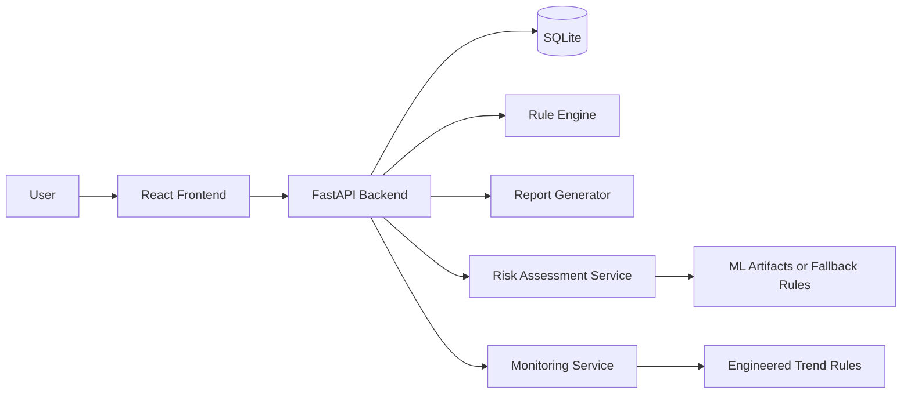

# Glyco Architecture

Glyco uses a React frontend, FastAPI backend, SQLite database, deterministic rule engine, report templates, and trained ML artifacts for primary risk and monitoring inference.

The MVP intentionally avoids a chatbot-first experience. Intelligence appears as explanations, flags, reports, and care suggestions.

Inference design:

- Risk assessments use the trained BRFSS random forest when artifacts are available.
- Monitoring assessments use the trained UCI trend model when enough user log history exists.
- Deterministic rules remain active for related flags, anomaly logic, explanations, and fallback behavior when artifacts fail to load or the user has too little data.
